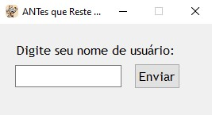
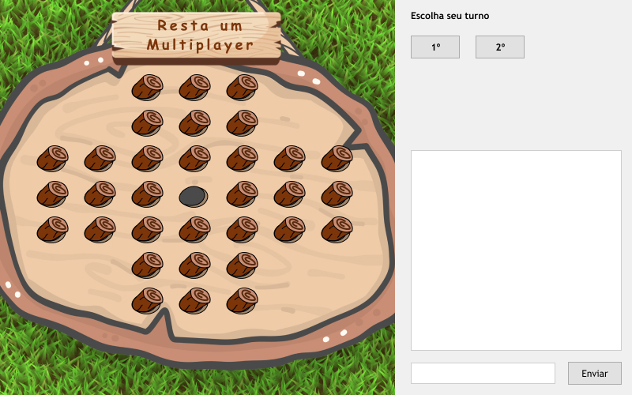
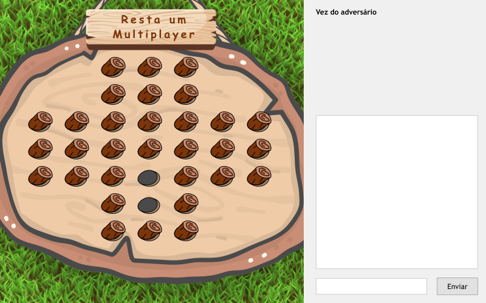
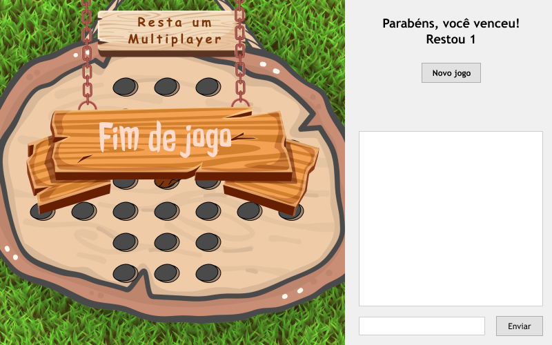

#  ANTes que reste uma 

Jogo de tabuleiro "Resta Um" - Multiplayer

Para saber como iniciar o jogo no seu computador, [clique aqui](#iniciar-o-programa)

## Índice

  * [Como jogar](#como-jogar)
    * [Definição de Nome](#definição-de-nome)
    * [Gameplay](#gameplay)
    * [Fim de Jogo](#fim-de-jogo)
    * [Condições de vitória](#condições-de-vitória)
  * [Detalhes Técnicos](#detalhes-técnicos)
    * [Iniciar o Programa](#iniciar-o-programa)
    * [Tecnologias utilizadas](#tecnologias-utilizadas)
    * [Comunicação via *RMI*](#comunicação-via-rmi)

## Como jogar
### Definição de Nome
Ao abrir o jogo abrirá uma tela (abaixo) onde será pedido para você informar o seu nome no jogo, digite o noem que deseja (**não são** permitidos nomes iniciados com numeros [ex.: "123bananinha"], nem com espaços  [ex.: "bananinha 123"]) e clique em "Enviar"

Caso o Nome iformado seja válido, seguiremos para a proxima tela

### Gameplay
Na parte inferior direita da tela há uma entrada de texto, onde se pode enviar mensagens para o adversário.
Na caixa acima, é possivel observar o histórico de conversas com o oponente.

Use o chat para decidir com o adversário quem irá iniciar o jogo, e segundo o que decidirem, clique no Botão que representa a sua decisão (parte superior a direita, "1º" caso você comece ou "2º" caso contrário), o jogo so iniciará quando as respostas de ambos forem compatíveis.

Após decidirem quem irá iniciar a partida, as peças do tabuleiro estarão disponíveis para a pessoa do turno atual realizar a jogada.
Para jogar clique na peça que você deseja movimentar, ela será selecionada (caso queira remover a seleção basta clicar novamente na mesma peça), em seguida clique na peça que deseja remover.
O turno só será passado para o próximo quando uma jogada válida for realizada.

  
  

### Fim de Jogo
O jogo acaba quando resta apenas uma peça no tabuleiro, ou quando não é mais possivel realizar jogadas. Ao clicar no botão "Novo Jogo" a fase de decisão de turnos será iniciada novamente para iniciar uma nova partida.

#### Condições de vitória
- Vence aquele realiza a jogada em que resta apenas uma peça no tabuleiro.
- Perde o jogador que realizar a jogada em que não é mais possível continuar o jogo e restar mais de uma peça no tabuleiro, o que desistir.

## Detalhes Técnicos

### Iniciar o Programa

Para inicializar o programa no seu computador, certifique se de que tem a linuagem python instalada (se ao rodar os comandos do passo seguinte 
ocorrer algum erro, rode no terminal `pip install Pyro4` e `pip install pygame`), e siga o seguinte passo a passo, na ordem em que se segue:
  - **1. Servidor de nomes**: para inicializar o servidor de nomes, abra um terminal e digite o comando `python -m Pyro4.naming`,
  e aparecerão os dados do host;
  - **2. Servidor do Jogo**: para inicializar o servidor abra um terminal na raiz do projeto e digite o comando `python inicializa_servidor.py`;
  - **3. Interface gráfica do jogador**:  para inicializar o jogo abra um terminal na raiz do projeto e digite o comando `python index.py`,
  e a tela de [definição de Nome](#definicao-de-nome) será inicializada;
  - **Obs.: (Multiplayer)**:  para iniciar o multiplayer siga o passo **3.** em um novo terminal (sem fechar o antigo) para a tela do segundo jogador.

### Tecnologias utilizadas

A aplicação foi desenvolvida utilizando 
com as bibliotecas:
  - **Threading**: para gerar threads concorrentes;
  - **Tkinter**: para interface gráfica;
  - **Pyro**: para comunicação online, tanto para a troca de mensagens no chat, quanto para o movimento das peças entre oponentes.
  - **PyInstaller**: para a geração do arquivo executável.

### Comunicação via *RMI*

Com o uso da biblioteca [Pyro4](https://pyro4.readthedocs.io/en/stable) foi criada uma classe abstrata IJogoRestaUm com as propiedades e métodos disponiveis para o servidor,
para que possa ser implementada como interface de comunicação servidor/cliente. O servidor do jogo é inicializado no servidor de nomes como "resta_um.servidor".
